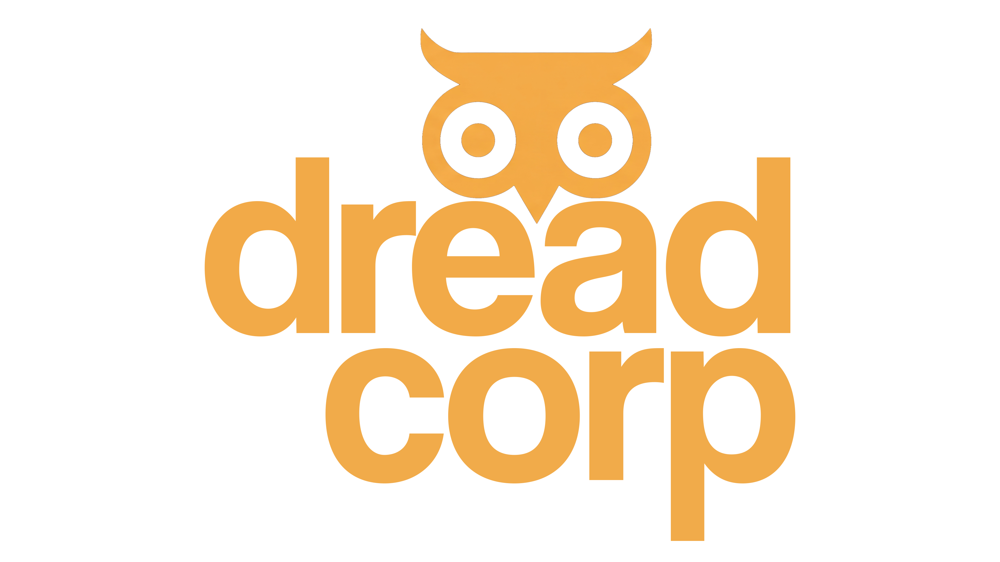
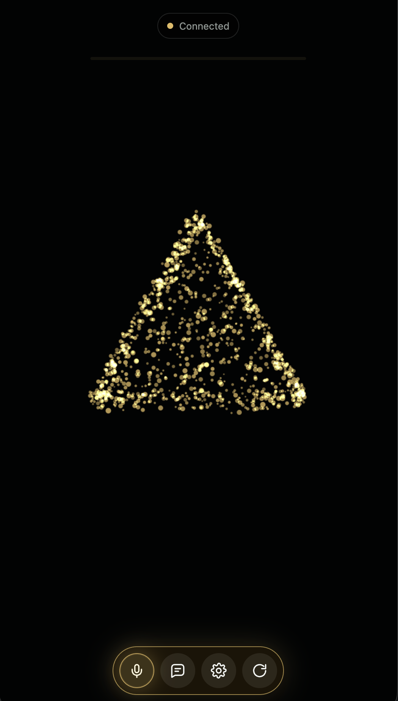

# Hermes Voice

<p align="center">
  
</p>

<p align="center">
  <strong>A self-hosted, realtime voice interface for Hermes agents.</strong>
</p>

<p align="center">
  <a href="#quick-start">Quick start</a> |
  <a href="#what-stands-out">What stands out</a> |
  <a href="#architecture">Architecture</a> |
  <a href="#demo-video">Demo video</a> |
  <a href="#demo-flow">Demo flow</a>
</p>

<p align="center">
  
  
  
  
</p>

Hermes Voice turns a Hermes API server into a polished spoken interface. It
packages the web client, LiveKit bridge, local speech fallback, voice synthesis,
and first-run setup flow into a Docker install that can run on a workstation,
homelab server, or small LAN box.

It is built for agents that are more than chatbots: the voice surface preserves
Hermes tools, memory, skills, and operational context while making the exchange
feel native to speech.

<p align="center">
  
</p>

## Demo Video

<p align="center">
  <a href="https://youtu.be/TJwmwtuBRGE?si=z0m9-Ec_1sI_mLU0">
    
  </a>
  <br>
  <a href="https://youtu.be/TJwmwtuBRGE?si=z0m9-Ec_1sI_mLU0"><strong>Watch the Hermes Voice demo</strong></a>
</p>

## Quick Start

Requirements:

- Docker with Docker Compose v2.
- An existing Hermes-compatible API endpoint with `/v1/chat/completions`.

Install:

```bash
curl -fsSL https://raw.githubusercontent.com/dreadcorp-labs/hermes-voice/main/packaging/bootstrap.sh | bash
```

Update:

```bash
curl -fsSL https://raw.githubusercontent.com/dreadcorp-labs/hermes-voice/main/packaging/bootstrap.sh | bash
```

The same command updates an existing install by pulling the latest `main`,
rebuilding the container, and preserving local runtime config.

The Settings screen can also request an update. Packaged installs include a
small updater helper container that owns Docker access, while the voice app only
writes a local update request file.

Open:

```text
http://localhost:8765/
```

If no API key is provided, Hermes Voice starts in setup mode. The setup page can
accept a full chat-completions URL or a simple `host:port`, and it can scan
configured private LAN ranges for likely Hermes endpoints. For a fresh packaged
install, use the setup URL printed by the installer; it includes a per-install
setup token used for settings changes.

Common override:

```bash
HERMES_API_URL="http://127.0.0.1:8642/v1/chat/completions" \
HERMES_API_KEY="..." \
bash -c "$(curl -fsSL https://raw.githubusercontent.com/dreadcorp-labs/hermes-voice/main/packaging/bootstrap.sh)"
```

Browser microphone note: browsers require HTTPS or localhost for microphone
capture. Raw LAN HTTP can load the UI, but typed chat is the only reliable input
until the page is served from `https://...` or `localhost`.

## What Stands Out

**Realtime voice room, not a form post.**  
Hermes Voice uses LiveKit for a persistent audio room. The browser joins as a
participant, the sidecar joins as the agent, and replies are streamed back as
audio rather than bolted onto a static chat page.

**Emotion-aware turns.**  
The packaged sidecar can run local voice-affect detection on the user's speech.
It extracts same-turn signals such as pace, energy, and affect, then passes a
compact adjustment hint into the Hermes turn so the agent can slow down, clarify,
or stay concise when the user's voice calls for it.

**A complete local voice pipeline.**  
The single-container package includes Kokoro voices, a Graillon-powered pitch
and formant stage, compression, ambience, delay, and reverb settings seeded from
the development voice container. The goal is not novelty effects; it is a
consistent, recognizable assistant voice with enough control to tune identity,
presence, and intelligibility.

**Speech fallback in the box.**  
Hermes Voice can use Hermes-hosted STT paths when available, and it includes a
local faster-whisper fallback so the install still has a speech path without
requiring another service for transcription.

**A UI designed for live agent work.**  
The client is built around a voice room, typed fallback, attachment tray,
device selectors, mic modes, tool/status readouts, and a settings surface that
can change model, TTS, STT, emotion recognition, and voice behavior without
editing files.

**First-run setup for real installs.**  
The packaged web setup flow collects the Hermes API URL/key, normalizes
`host:port` into the OpenAI-compatible chat path, and writes local configuration
without committing secrets to the repo.
The packaged model selector starts with the Hermes gateway default and then
uses whatever models the configured Hermes API advertises.

**Browser and desktop surfaces.**  
The browser UI works well on phones and desktops. The Electron shell adds a
desktop wrapper and global mic toggle path for workstation use.

## Architecture

The default package is a single Docker container that runs:

- Hermes Voice WebUI and Python sidecar.
- LiveKit server.
- Redis for LiveKit room state.
- Kokoro/Graillon TTS service.
- Local STT fallback dependencies.
- Local voice-emotion worker.

Hermes itself remains external. That keeps the voice client focused: it handles
audio, setup, transcription, affect hints, and playback, while the Hermes API
server continues to own tools, memory, routing, and reasoning.

```text
Browser or desktop client
        |
        | WebRTC audio + data
        v
LiveKit room inside Hermes Voice
        |
        v
Python sidecar
        |
        | STT + affect hints + chat-completions request
        v
External Hermes API server
        |
        | assistant text
        v
Kokoro/Graillon TTS pipeline
        |
        | generated audio
        v
LiveKit playback to client
```

## Demo Flow

1. Run the one-line installer.
2. Open the WebUI and complete setup with a Hermes API URL and API key.
3. Join the voice room from a browser or the desktop shell.
4. Ask a normal assistant question, then ask something that needs tools or
   memory to show that Hermes Voice preserves the full agent backend.
5. Toggle emotion recognition and compare how the agent's spoken response adapts
   to fast, uncertain, or calm speech.
6. Open settings to show live model, TTS, STT, audio device, mic mode, and voice
   behavior controls.

## Configuration

Run from a local checkout:

```bash
./packaging/install.sh
```

Useful environment variables:

```bash
HERMES_VOICE_INSTALL_DIR="$HOME/.hermes-voice"
HERMES_VOICE_PUBLIC_HOST="localhost"
HERMES_VOICE_BIND_HOST="127.0.0.1"
WEBUI_PORT=8765
LIVEKIT_PORT=7880
TTS_PORT=8890
REDIS_PORT=16379
HERMES_API_URL="http://127.0.0.1:8642/v1/chat/completions"
HERMES_API_KEY="..."
HERMES_API_MODEL="hermes-agent"
HERMES_API_PROVIDER="hermes"
```

`HERMES_API_MODEL` is a per-voice-session override sent to the Hermes agent API.
It does not bypass Hermes tools, memory, or prompt context. The WebUI settings
model dropdown edits this value and is populated from the configured Hermes
gateway's `/v1/models` endpoint.

Set `HERMES_VOICE_BIND_HOST=0.0.0.0` only when you intentionally want to expose
the packaged services beyond localhost.

Set `HERMES_VOICE_PACKAGE_MODE=multi` to use the older multi-container layout
with separate Redis, LiveKit, sidecar, and TTS services.

## Repository Layout

- `sidecar/livekit_voice_server.py`: LiveKit agent bridge and HTTP API.
- `sidecar/static/`: browser client and setup UI.
- `tts/`: OpenAI-compatible Kokoro/Graillon TTS service.
- `packaging/`: one-line installer, Compose files, all-in-one Dockerfile.
- `desktop/`: Electron wrapper for workstation use.
- `deploy/`: reference templates for manual deployments.
- `docs/`: architecture and backend notes.
- `assets/`: screenshot and Dreadcorp Labs branding used by this README.

## Current Notes

- Secrets are intentionally not committed. Runtime config lives under the local
  install directory.
- Microphone capture requires HTTPS or localhost in modern browsers.
- The packaged image is intentionally self-contained for voice/TTS/LiveKit, but
  it still expects an external Hermes API server.
- First install can take several minutes while Docker builds the image and
  downloads model/plugin assets.

## Dreadcorp Labs

Hermes Voice is packaged by Dreadcorp Labs as a local-first voice interface for
agent systems that already do real work. The included branding assets are kept
under `assets/` so the repo, organization profile, and demo material can share
the same visual identity.
